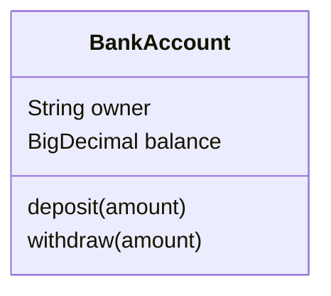

# mermaid-java-dsl
[](https://github.com/lamzi-com/mermaid-java-dsl/actions/workflows/build.yml)
[](https://central.sonatype.com/artifact/com.lamzi.doc/mermaid-java-dsl)

A type-safe Java DSL for generating [Mermaid](https://mermaid.js.org/) diagrams programmatically.

The library is designed for automation and living documentation.
Instead of manually assembling Mermaid syntax with strings, it provides a fluent,
strongly-typed API for building diagrams from Java code.


## Quick start

Add the dependency:

```xml
<dependency>
    <groupId>com.lamzi.doc</groupId>
    <artifactId>mermaid-java-dsl</artifactId>
    <version>0.1.0</version>
</dependency>
```

Then generate a Mermaid diagram programmatically:

```java
ClassDiagram diagram = new ClassDiagram();

diagram.classElement(
        aClass("BankAccount") 
            .member(attribute("owner").type(type("String")))
            .member(attribute("balance").type(type("BigDecimal")))
            .member(method("deposit").parameter(parameter("amount")))
            .member(method("withdraw").parameter(parameter("amount")))
);

System.out.println(diagram.generate());
```

Output:



## Status

This project is in an early stage.

The class diagram DSL is functional and tested against the official Mermaid 
documentation examples (currently verified with Mermaid 10.2.4).

The public API is still evolving and not yet fully documented. Breaking changes
may happen before a stable 1.0 release.

## Current support
- ✅ Class diagrams — implemented and tested against the official Mermaid documentation examples
- 🚧 Flowcharts (planned)
- 🚧 Sequence diagrams (planned)


## Project scope

The project is developed around practical use cases, primarily automation and living documentation.

Mermaid features are implemented incrementally based on real-world needs rather than with the goal of exhaustively covering the entire Mermaid syntax.

Contributions, bug reports, and feature requests are welcome.
